# 管理者支援システム Ver0.5 取扱説明書

看護師などの勤務表作成を支援する、ローカル動作のWebアプリです。

## 使い方

詳しい操作方法は、以下の取扱説明書を参照してください。

[取扱説明書を開く](docs/manual.html)

## 1. アプリ概要

「管理者支援システム Ver0.5」は、看護師などの勤務表作成を支援するローカルWebアプリです。勤務を自動で完成させるソフトではなく、勤務記号や登録済みパターンを配置しながら、勤務表のたたき台を作るためのツールです。

このアプリでは、勤務入力、希望入力、パターン管理、自動配置、自動調整、警告表示、評点、日別集計、個人集計、NGペア設定などを利用できます。データはブラウザの localStorage に自動保存されます。

実行にサーバーやログインは不要です。HTML、CSS、JavaScript のみで動作します。

## 2. 画面構成

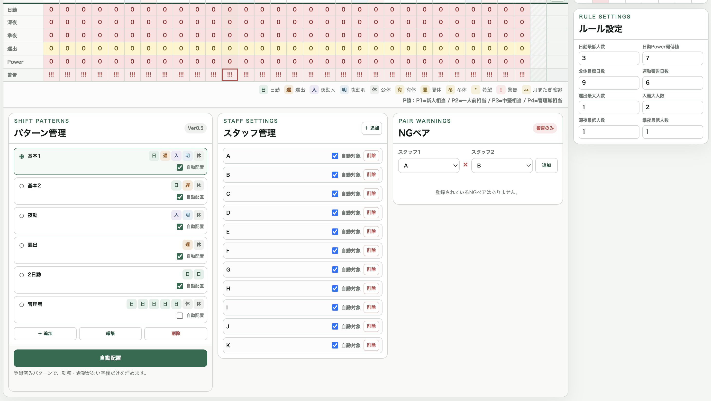

画面は大きく以下の要素で構成されています。

- 上部ヘッダー：アプリ名、評点、P値凡例、保存状態、月変更、シフト表クリア、初期化
- 勤務表エリア：行事予定、日付、曜日、スタッフ別勤務表、日別集計、警告行
- 勤務表操作エリア：自動調整、ハイライト色、勤務入力／希望入力の切り替え
- 勤務表下の設定エリア：パターン管理、スタッフ管理、NGペア
- 右側パネル：個人集計、ルール設定

PC画面では勤務表と個人集計が横並びで表示されます。狭い画面では縦方向に並ぶ場合があります。

## 3. 勤務入力モードの使い方

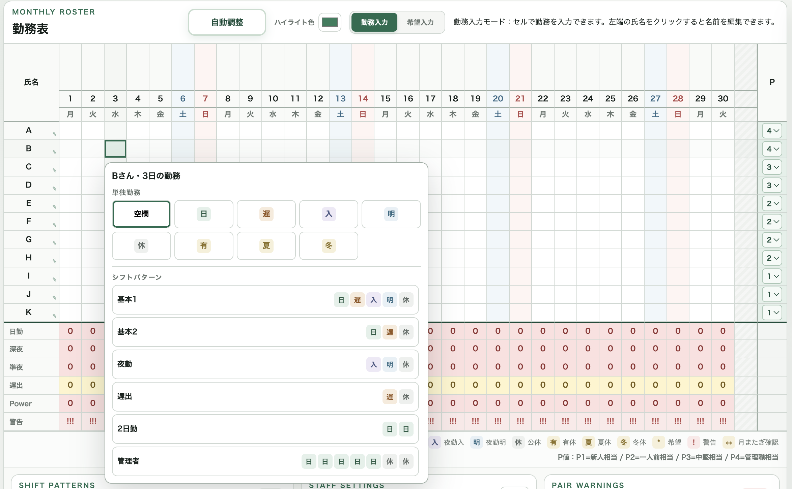

画面上部の「勤務入力」を選ぶと、勤務入力モードになります。

勤務セルをクリックすると、勤務選択メニューが表示されます。単独勤務として以下を入力できます。

- 空欄
- 日
- 遅
- 入
- 明
- 休
- 有
- 夏
- 冬

勤務を選ぶと、そのセルの勤務が変更されます。入力後は、日別集計、個人集計、警告、評点が再計算され、自動保存されます。

勤務選択メニューには、登録済みのシフトパターンも表示されます。パターンを選ぶと、クリックしたスタッフ・クリックした日付を開始位置として、その行にパターンが配置されます。

## 4. 希望入力モードの使い方

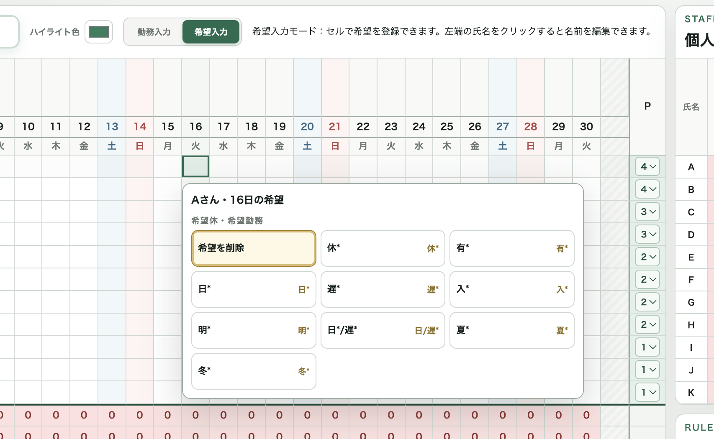

画面上部の「希望入力」を選ぶと、希望入力モードになります。

勤務セルをクリックすると、希望入力メニューが表示されます。入力できる希望は以下です。

- 希望を削除
- 休
- 有
- 日
- 遅
- 入
- 明
- 日/遅
- 夏
- 冬

希望が入っているセルは、表示に `*` が付きます。例として、希望日で勤務も日勤の場合は `日*` のように表示されます。希望だけが入力されていて勤務が未入力の場合も、希望内容が `日*` や `日/遅*` のように表示されます。

希望は勤務データとは別に保存されます。希望を削除しても、既に入っている勤務は削除されません。

希望と違う勤務を手入力しようとした場合、勤務は変更されず、通知が表示されます。パターン配置でも、希望と合わないセルは上書きされません。

## 5. スタッフ名・P値の編集方法

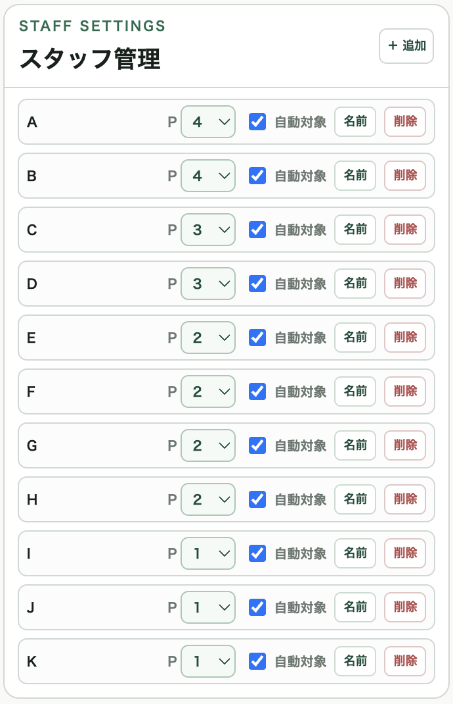

スタッフ名は、勤務表下のスタッフ管理にある「名前」ボタンから編集できます。氏名編集ダイアログで名前を入力し、「保存」を押します。

P値はスタッフ管理内の `P` 欄で選択できます。勤務表右端のP列は表示専用です。選べる値は `1`、`2`、`3`、`4` です。

P値の意味は以下です。

- P1：新人相当
- P2：一人前相当
- P3：中堅相当
- P4：管理職相当

P値を変更すると、日別Power集計、警告、評点に反映され、自動保存されます。

## 6. スタッフ追加・削除の方法

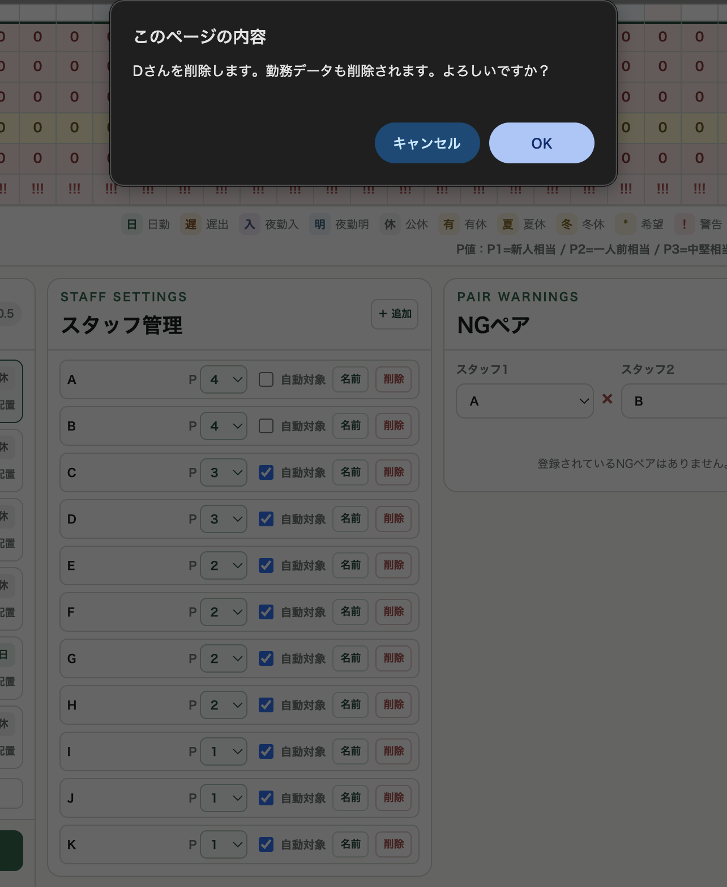

勤務表下の「スタッフ管理」でスタッフを追加・削除できます。

「＋ 追加」を押すと、新しいスタッフが追加されます。初期値は以下です。

- 氏名：新規スタッフ
- P値：1
- 自動対象：ON
- 勤務データ：空欄
- 希望データ：空欄

スタッフを削除する場合は、対象スタッフの「削除」を押します。確認ダイアログでOKすると、そのスタッフの勤務データ、希望データ、NGペア設定が削除されます。

スタッフが1人だけの場合は削除できません。

## 7. 自動配置の使い方

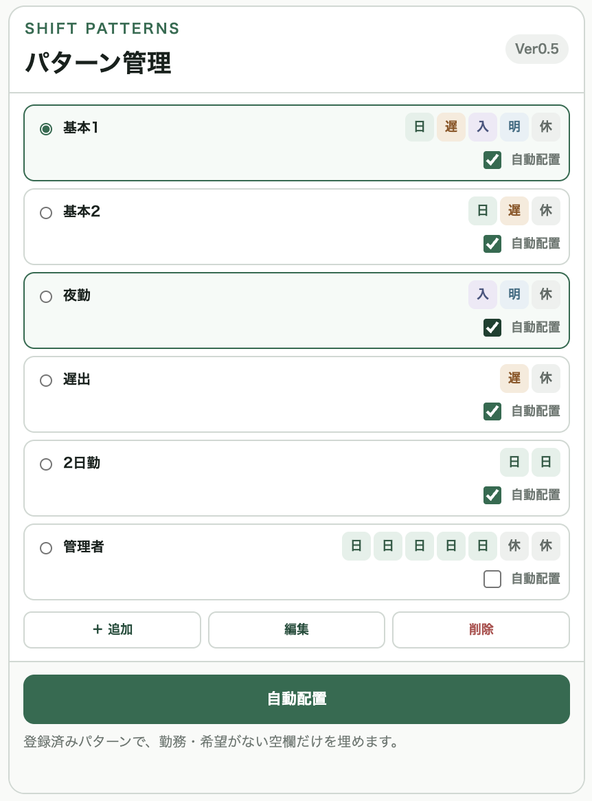

勤務表下の「パターン管理」にある「自動配置」ボタンを押すと、登録済みパターンを使って空欄セルを埋めます。

自動配置の対象は、以下の条件を満たすセルです。

- 勤務が空欄
- 希望が入っていない
- スタッフ管理で「自動対象」がON

自動配置は、勤務を1マスずつランダムに入れるのではなく、登録済みパターン単位で配置します。自動配置に使われるのは、パターン管理で「自動配置」にチェックが入っているパターンです。

配置後には、配置したパターン件数と自動入力したセル数が表示されます。

## 8. 自動調整の使い方

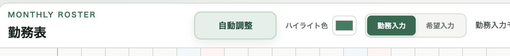

勤務表上部の「自動調整」ボタンを押すと、現在の勤務表をもとに、評点が上がる小さな変更を試します。

自動調整は勤務表を作り直す機能ではありません。現在の勤務表に対して、スコアが改善する変更だけを採用します。

自動調整で主に扱う勤務は `日`、`遅`、`休` です。夜勤に関する調整も一部ありますが、希望入力があるセル、有休、夏休、冬休は変更しません。

スタッフ管理で「自動対象」がOFFのスタッフは、自動調整の対象外です。ただし、手入力された勤務は集計や警告には含まれます。

処理後には、変更前後のスコアと採用した変更件数が表示されます。

## 9. パターン管理の使い方

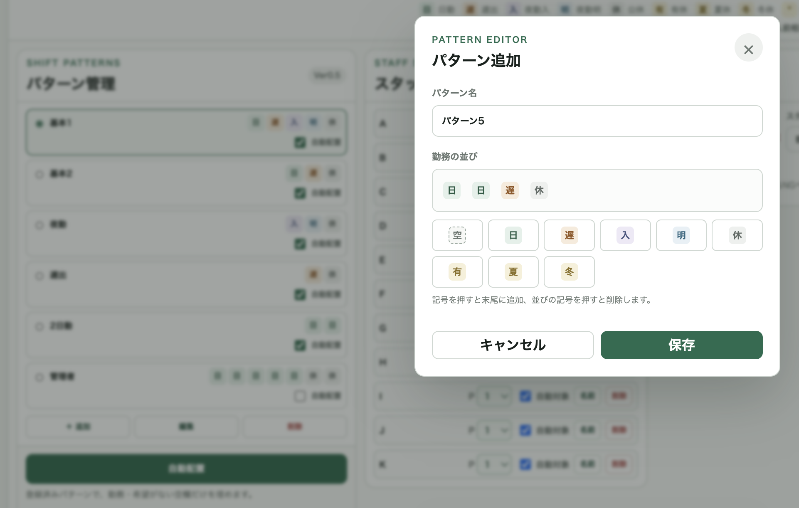

勤務表下の「パターン管理」で、シフトパターンを追加・編集・削除できます。

初期パターンは以下です。

- 基本1：日 遅 入 明 休
- 基本2：日 遅 休
- 夜勤：入 明 休
- 遅出：遅 休
- 2日勤：日 日
- 管理者：日 日 日 日 日 休 休

パターンには空欄も含めることができます。パターン編集画面では、勤務記号を押すと末尾に追加され、並びの記号を押すと削除されます。

各パターンには「自動配置」のチェックがあります。チェックがONのパターンだけが自動配置で使われます。チェックOFFのパターンも、セルメニューからの手動配置には使用できます。

## 10. スタッフ管理の使い方

「スタッフ管理」では、スタッフの追加、削除、自動対象のON/OFFを設定できます。

「自動対象」がONのスタッフは、自動配置と自動調整の対象になります。OFFにすると、自動配置・自動調整では変更されません。

自動対象をOFFにしても、勤務表上には表示され、手入力、希望入力、集計、警告、評点には通常通り含まれます。

スタッフ名の編集はスタッフ管理の「名前」ボタンから行います。P値の編集はスタッフ管理のP欄から行います。

## 11. NGペア設定の使い方

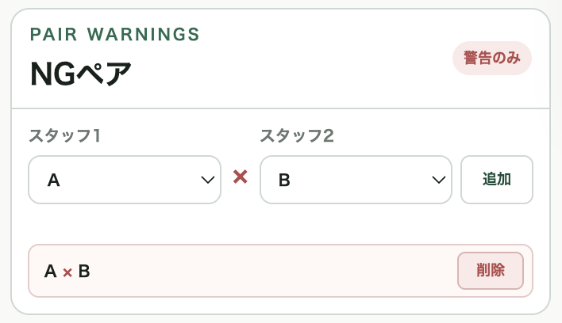

「NGペア」では、同じ勤務にしたくないスタッフの組み合わせを登録できます。

スタッフ1とスタッフ2を選択し、「追加」を押すとNGペアとして登録されます。同じスタッフ同士は登録できません。同じ組み合わせの重複登録もできません。

登録済みNGペアは一覧に表示され、「削除」で解除できます。

NGペアは配置禁止ではなく、警告表示のみです。以下の場合に警告が出ます。

- NGペアの2人が同じ日に両方 `日`
- NGペアの2人が同じ日に両方 `入`

`入` と `遅` の組み合わせなどはNGペア警告の対象ではありません。

## 12. 行事予定欄の使い方

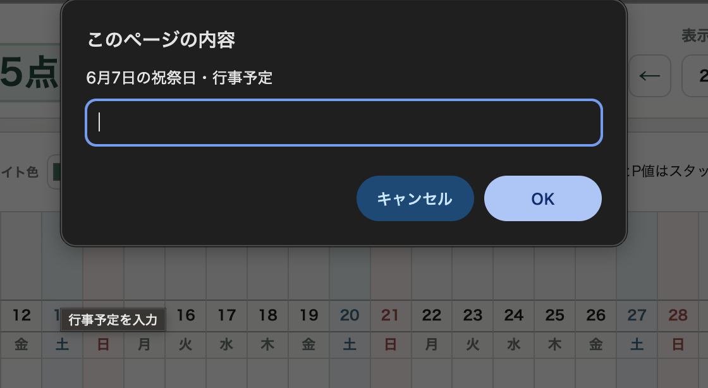

勤務表の日付行の上に、行事予定欄があります。

行事予定欄をクリックすると、その日の祝祭日・行事予定を入力できます。入力した内容は縦書きで表示されます。長い内容はセル内で省略される場合がありますが、カーソルを合わせるとブラウザの補助表示で内容を確認できます。

行事予定はメモ機能です。警告、評点、自動配置、自動調整には影響しません。

## 13. 評点の見方

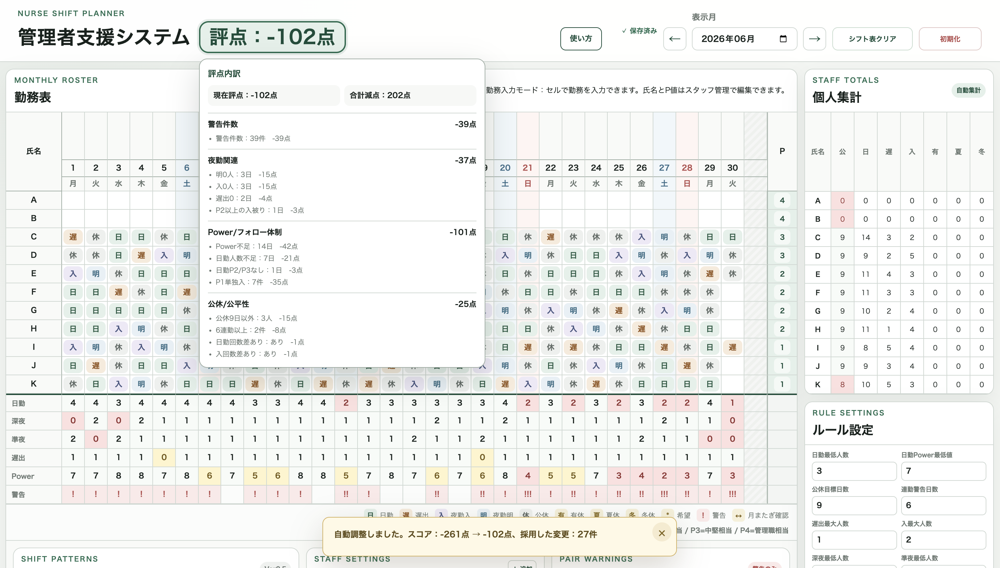

画面上部に「評点」が表示されます。

評点は100点から減点する方式です。減点が多い場合は、0点未満のマイナス点になることがあります。

スコアには、警告件数、夜勤関連、公休や公平性、Power不足、NGペアなどが反映されます。点数は勤務表の良し悪しを確認するための目安です。勤務の可否を最終判断するものではありません。

## 14. 評点内訳の見方

評点部分にカーソルを合わせる、またはクリック／タップすると、減点内訳が表示されます。

内訳は以下の分類で表示されます。

- 警告件数
- 夜勤関連
- Power/フォロー体制
- 公休/公平性
- NGペア

各分類には、件数と減点数が表示されます。どの問題を直すとスコアが上がりやすいかを確認できます。

## 15. 警告表示の見方

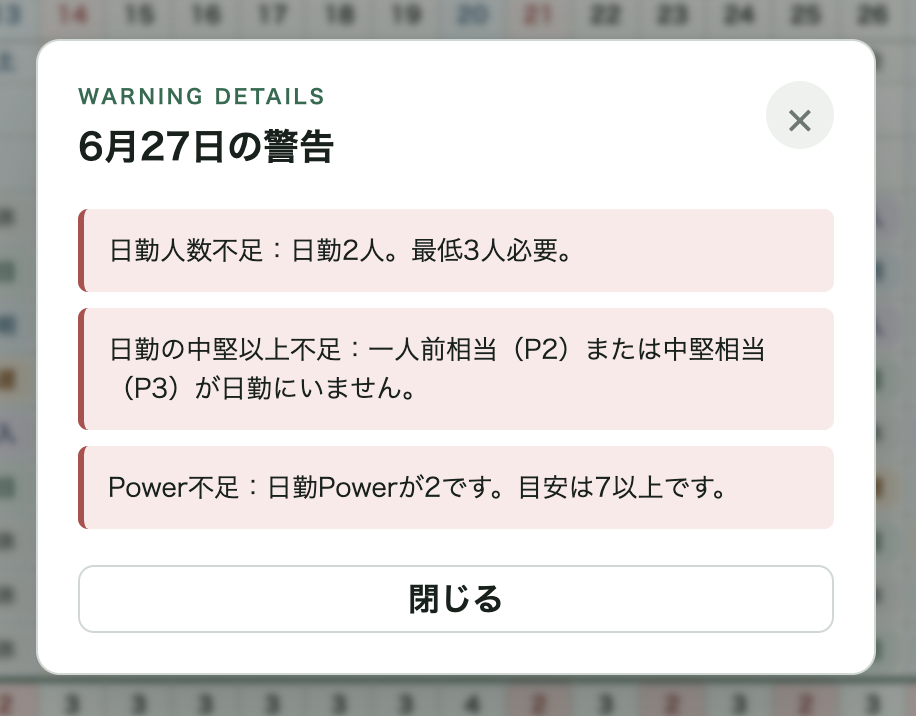

勤務表下部の「警告」行に、その日の警告数に応じて `!` が表示されます。

- 警告0件：空欄
- 警告1件：!
- 警告2件：!!
- 警告3件以上：!!!

`!` をクリックすると、警告詳細が表示されます。

警告の例は以下です。

- 日勤人数不足
- 日勤のP2/P3不足
- Power不足
- 入の翌日が明ではない
- 明の翌日が休ではない
- 遅出の翌日が日または明
- 連勤警告
- P1単独入
- P2以上の入が複数
- P1の入が複数
- 入が設定上限を超えている
- 遅出が設定上限を超えている
- NGペアの日勤被り
- NGペアの夜勤入り被り

警告は勤務入力を禁止するものではありません。確認用の表示です。

## 16. 月またぎ確認の見方

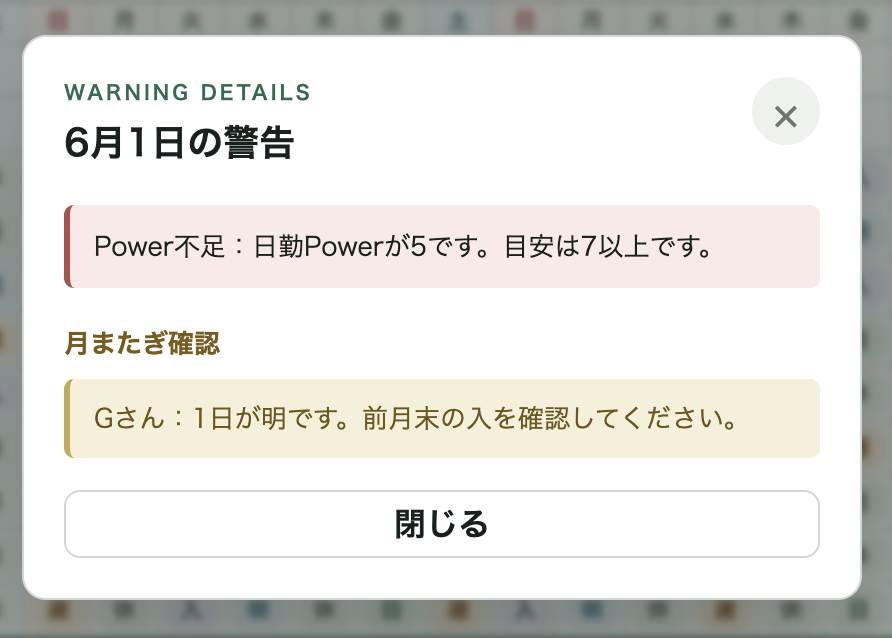

月初または月末で、表示中の月だけでは判定できない勤務がある場合、警告行に `↔` が表示されます。

例として、1日が `明` の場合、前月末に `入` があったかはこの月だけでは確認できません。そのため通常の違反警告ではなく、月またぎ確認として表示されます。

`↔` をクリックすると、月またぎ確認の詳細が表示されます。

月またぎ確認は、警告件数や評点の減点には含まれません。

## 17. 日別集計・個人集計の見方

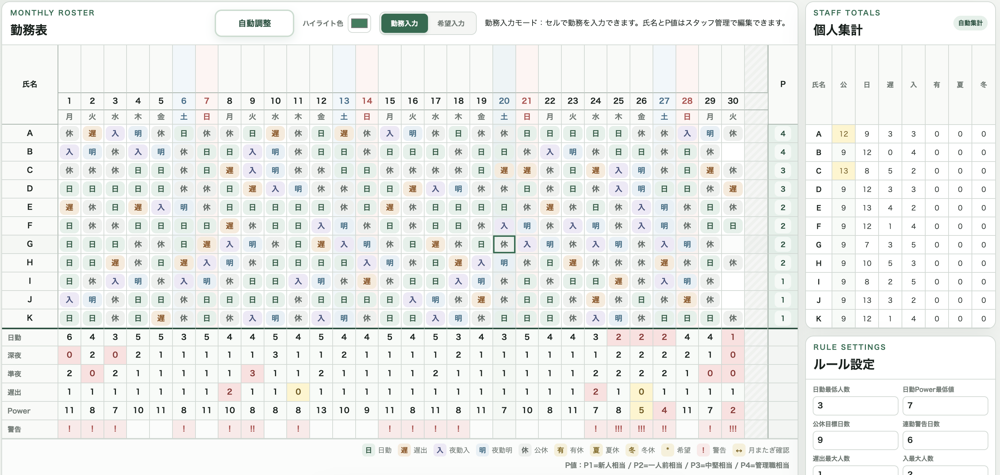

日別集計は勤務表の下に表示されます。

- 日勤：その日の `日` の人数
- 深夜：その日の `明` の人数
- 準夜：その日の `入` の人数
- 遅出：その日の `遅` の人数
- Power：その日の `日` スタッフのP値合計
- 警告：警告または月またぎ確認の表示

0の場合も `0` と表示されます。

集計セルには状態に応じた色が付きます。

- 淡い黄色：注意
- 淡い赤：危険
- 通常色：基準内

個人集計は右側に表示されます。

- 公：`休` の数
- 日：`日` の数
- 遅：`遅` の数
- 入：`入` の数
- 有：`有` の数
- 夏：`夏` の数
- 冬：`冬` の数

個人集計も0の場合は `0` と表示されます。公休数はルール設定の公休目標日数と比較して色が付きます。

## 18. ルール設定の使い方

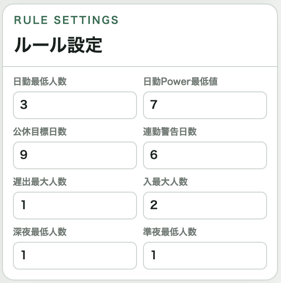

右側の「ルール設定」で、警告や集計色、評点に使う基準値を変更できます。

設定できる項目は以下です。

- 日勤最低人数
- 日勤Power最低値
- 公休目標日数
- 連勤警告日数
- 遅出最大人数
- 入最大人数
- 深夜最低人数
- 準夜最低人数

値を変更すると、勤務表、日別集計、個人集計、警告、評点に反映されます。変更内容は自動保存されます。

## 19. ハイライト色設定の使い方

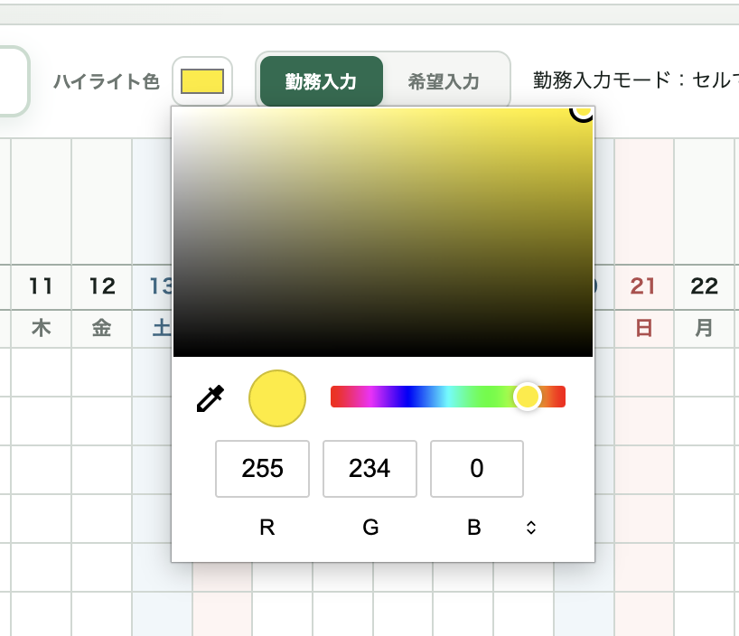

勤務表上部の「ハイライト色」で、マウスを合わせた行・列の十字ハイライト色を変更できます。

色を変更するとすぐに勤務表へ反映され、自動保存されます。ハイライトは薄い表示で、警告色や集計色をできるだけ邪魔しないように設定されています。

## 20. シフト表クリアと初期化の違い

「シフト表クリア」は、現在表示している月の勤務データだけを空欄にします。

残るものは以下です。

- 希望入力
- パターン
- スタッフ
- P値
- 自動対象設定
- NGペア
- 行事予定
- ルール設定
- 表示月

「初期化」は、localStorage の保存データを削除し、初期状態に戻します。スタッフ、パターン、希望、勤務、NGペア、ルール設定なども初期状態になります。

どちらも実行前に確認ダイアログが表示されます。

## 21. localStorage保存について

このアプリは保存ボタンを使わず、操作時に自動保存します。保存先は使用中のブラウザの localStorage です。

保存される主な内容は以下です。

- 表示年月
- スタッフ情報
- P値
- 自動対象設定
- 勤務データ
- 希望データ
- 行事予定
- パターンデータ
- NGペア
- ルール設定
- ハイライト色

保存状態は画面上部の「✓ 保存済み」で確認できます。

注意点として、ブラウザや端末を変更すると保存データは共有されません。また、ブラウザの閲覧データ削除や localStorage 削除を行うと、保存データが消える場合があります。

## 22. 注意事項・免責

このアプリは勤務表作成を支援するためのツールです。勤務表の内容を自動的に保証するものではありません。

警告や評点は確認を補助する表示です。最終的な勤務可否、労務管理上の判断、施設ごとの運用ルールへの適合は、必ず利用者が確認してください。

現在の実装では、Excel読込、CSV出力、クラウド保存、ログイン、複数端末同期は実装されていません。

自動配置と自動調整は、勤務表を完全に作成する機能ではありません。人が手直しする前提のたたき台作成・改善補助として使用してください。

## 実装済み機能一覧

- 月表示変更
- 勤務入力
- 希望入力
- 希望保護
- 勤務セルからのパターン配置
- パターン追加・編集・削除
- パターンごとの自動配置対象設定
- 自動配置
- 自動調整
- スタッフ名編集
- P値編集
- スタッフ追加・削除
- スタッフごとの自動対象設定
- NGペア追加・削除
- 行事予定入力
- 日別集計
- 個人集計
- 集計セルの色付き表示
- 警告表示
- 警告詳細表示
- 月またぎ確認
- 評点表示
- 評点減点内訳表示
- ルール設定
- ハイライト色設定
- 十字ハイライト
- シフト表クリア
- 初期化
- localStorage自動保存・復元

## 今後追加予定にできそうな機能一覧

以下は、現在のコード上では実装済みではない、または本格実装ではないため、今後の追加候補として整理します。

- Excel読込
- CSV出力
- 印刷用レイアウト
- クラウド保存
- ログイン機能
- 複数端末での同期
- 希望休一覧の集計表示
- 行事予定に応じた日勤人数・Power基準の自動変更
- 自動配置ロジックの高度化
- 夜勤セット作成の高度化
- 勤務表のバックアップ・復元
- スタッフ並び替え
- 勤務表のコピー機能
- 完成版勤務表の出力機能

## 顧客向けの短い紹介文

「管理者支援システム」は、勤務表作成時の入力・確認・調整を支援するWebアプリです。勤務記号やシフトパターンを配置しながら、希望勤務、警告、集計、評点を確認できます。自動配置と自動調整により、空欄を埋めるたたき台作成やスコア改善を補助し、最終確認は管理者が行えるよう設計されています。
