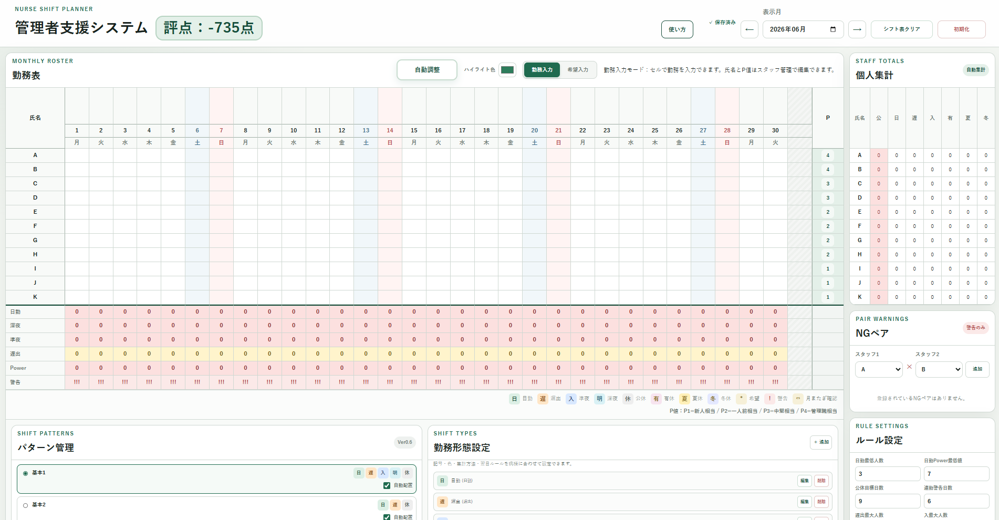

# 管理者支援システム Ver0.7.2

## 1. 一言メッセージ

勤務表の入力、確認、調整を一つの画面で行い、作成作業の負担を軽くするための補助ツールです。

## 2. アプリ概要

「管理者支援システム Ver0.7.2」は、看護師などの勤務表作成を支援するHTML/CSS/JavaScript製の静的Webアプリです。勤務や希望の入力、勤務パターンの配置、集計、警告、評点、CSV出力、印刷用レイアウト、カスタム設定などを使い、勤務表のたたき台作成と確認を補助します。

サーバーやログインは不要で、GitHub Pagesから利用できます。データは使用中のブラウザのlocalStorageに自動保存されます。

[詳しい取扱説明書を開く](docs/manual.html)

## 3. 主な機能

- 勤務入力モードと希望入力モード
- スタッフ管理（追加・削除、P値、勤務上限、自動配置・自動調整対象のON/OFF）
- 勤務形態設定（追加・編集・削除、色、集計属性、前後関係ルール）
- 勤務パターン管理、NGペア管理、ルール設定、カスタム設定
- 自動配置と自動調整
- 日別集計と個人集計、勤務上限超過時の色付け
- CSV出力（勤務表、個人集計、日別集計、警告一覧）
- 印刷用レイアウト、白黒印刷対応、A4横向き印刷、提出前チェック用レイアウト
- 希望勤務を勤務表へ反映
- 色付き勤務バッジを使った勤務選択UI
- 行事予定欄、参加スタッフ設定、行事予定から希望勤務への反映
- 評点・評点内訳、警告表示、月またぎ確認
- ハイライト設定、シフト表クリア、初期化
- localStorageによる自動保存

## 4. 基本的な使い方

1. 表示する年月を選び、スタッフ管理で氏名、P値、勤務上限、自動処理の対象を設定します。
2. 必要に応じて勤務形態、勤務パターン、NGペア、ルールを設定します。
3. 希望入力モードでスタッフの希望を登録します。
4. 必要に応じて「希望を勤務表へ反映」で、空欄セルへ希望勤務を反映します。
5. 勤務入力モード、自動配置、自動調整を使って勤務表を作成します。
6. 日別集計、個人集計、警告、月またぎ確認、評点内訳を確認し、手作業で調整します。
7. 必要に応じてCSV出力や「印刷前チェック」で勤務表を確認し、最後に勤務表全体を人の目で確認します。

詳しい操作方法と各表示の見方は[取扱説明書](docs/manual.html)を参照してください。

カスタム設定では、現在の警告・評点ロジックを「組み込み判定」として一覧表示し、削除不可のままON/OFFできます。また、文章テンプレートと選択肢を使って「入が2人以上なら遅出0の警告・減点を無効にする」「P1が入ならP2以上も入に1人以上必要」といった条件を複数追加・編集・削除できます。設定は警告、評点、評点内訳、日別集計の色付けに反映されます。

## 5. 実装済み機能一覧

- 勤務入力、希望入力、希望と異なる勤務の上書き防止、希望を勤務表へ反映
- スタッフの追加・削除、名前・P値・勤務上限の設定
- スタッフごとの自動配置・自動調整対象設定
- 勤務形態の追加・編集・削除、色・集計属性・前後関係ルールの設定
- 勤務パターンの追加・編集・削除、勤務パターンごとの自動配置対象設定
- NGペア管理、ルール設定、カスタム設定、自動配置、自動調整
- 日別集計、個人集計、上限超過時の個人集計色付け
- 文章テンプレ＋選択肢による複数のカスタム条件設定
- 組み込み判定の一覧表示とON/OFF切り替え
- カスタム設定の警告、評点、評点内訳、日別集計色付けへの反映
- CSV出力（勤務表、個人集計、日別集計、警告一覧）
- 印刷用レイアウト、白黒印刷対応、A4横向き印刷、提出前チェック用レイアウト
- 勤務選択UIの色付きバッジ表示
- 行事予定入力画面、参加スタッフ設定、行事予定から希望勤務への反映
- 評点・評点内訳、警告、月またぎ確認
- ハイライト設定、シフト表クリア、初期化、localStorage自動保存・復元

## 6. 検討中の機能一覧

以下は将来的に対応したい機能候補です。いずれも検討中であり、実装時期は未定です。

- 印刷まわりの改善：印刷レイアウトの微調整、1ページに収める設定、個人集計だけを印刷する機能、日別集計だけを印刷する機能、提出用と確認用の印刷レイアウト切り替え、施設ごとの帳票レイアウト調整、様式9に近い確認用レイアウトの改善
- 行事予定機能の拡張：行事予定ありの日を将来的にルール設定・評点へ反映
- 半日勤務への対応：勤務形態ごとの勤務量設定、半日勤務・半日有休・午前勤務・午後勤務、集計・評点・警告への勤務量反映
- 例外ルール設定の拡充：曜日、行事予定、スタッフ条件などに応じて通常ルールの警告・減点・基準を切り替える選択式設定
- 自動調整の改善：優先して直す警告の選択、日勤人数不足・Power不足・NGペア・勤務構造・スタッフ別上限超過の優先度設定、自動調整ログ
- クラウド保存、ログイン、複数端末同期
- 自動配置ロジック、夜勤セット作成の高度化
- バックアップ・復元、スタッフ並び替え、勤務表コピー

## 7. 注意事項・免責

このツールは勤務表作成を補助する試作ツールです。警告、評点、自動配置、自動調整の結果を含め、最終確認は必ず人が行ってください。

労務管理、法令、所属施設の規程への適合を保証するものではありません。実名や個人情報を入力する場合は所属施設のルールに従い、正式運用前には十分な確認とテストを行ってください。

localStorageのデータはブラウザや端末をまたいで共有されません。閲覧データの削除や初期化により保存内容が失われる場合があります。

印刷時はブラウザの印刷機能を使用します。用紙はA4横向きを基本にし、白黒で確認しやすいように操作ボタンや設定ブロックを非表示にします。ブラウザやプリンター設定によって縮尺や余白が変わるため、提出前に印刷プレビューで確認してください。
